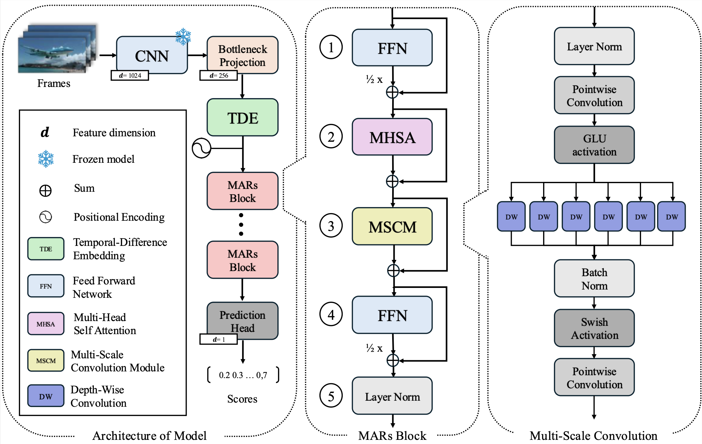

<a name="top"></a>
# MARs : Multi-Scale Convolution-Attention residual Fusion for Video Summarization (MMSys 2026)



## Requirements
|Ubuntu|GPU|CUDA|cuDNN|conda|python|
|:---:|:---:|:---:|:---:|:---:|:---:|
|20.04.6 LTS|NVIDIA GeForce RTX 3080|12.1|8902|4.9.2|3.8.5|

|h5py|numpy|scipy|torch|torchvision|tqdm|
|:---:|:---:|:---:|:---:|:---:|:---:|
|3.1.0|1.19.5|1.5.2|2.2.1|0.17.1|4.61.0|

## Data
Link: [Dataset](https://drive.google.com/drive/folders/1iGfKZxexQfOxyIaOWhfU0P687dJq_KWF?usp=drive_link) <br/>
H5py format of two benchmark video summarization preprocessed datasets (SumMe, TVSum). <br/>
You should download datasets and put them in ```data/``` directory. <br/>
The structure of the directory must be like below. <br/>
```
 ├── data
     └── eccv16_dataset_summe_google_pool5.h5
     └── eccv16_dataset_tvsum_google_pool5.h5
```
You can see the details of both datasets below. <br/>

## Training and Inference

Due to GitHub storage limitations, pretrained model weights (checkpoints) are **not** included in this repository.  
To reproduce the results or evaluate the model performance, you must first train the model and then run inference 

## KTS algorithm
We referenced the KTS code from [DSNet](https://github.com/li-plus/DSNet).<br/>
However, they applied KTS to downsampled videos (2 fps), which can result in different shot change points and sometimes make it impossible to summarize videos. <br/>
We revised it to calculate change points based on the entire frames. <br/>

## Acknowledgement
We especially, sincerely appreciate the authors of CSTA who responded to our requests very kindly. <br/>


CSTA - [paper](https://arxiv.org/abs/2405.11905), [code](https://github.com/thswodnjs3/CSTA) <br/>

[Back to Top](#top)
